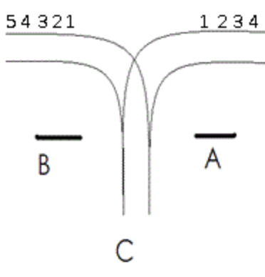

题目：
【题目描述】

有一个火车站，铁路如图所示，每辆火车从A驶入，再从B方向驶出，同时它的车厢可以重新组合。假设从A方向驶来的火车有n节（n≤1000），分别按照顺序编号为1，2，3，…，n。假定在进入车站前，每节车厢之间都不是连着的，并且它们可以自行移动到B处的铁轨上。另外假定车站C可以停放任意多节车厢。但是一旦进入车站C，它就不能再回到A方向的铁轨上了，并且一旦当它进入B方向的铁轨，它就不能再回到车站C。负责车厢调度的工作人员需要知道能否使它以a1,a2,…,an的顺序从B方向驶出，请来判断能否得到指定的车厢顺序。



 

【输入】

第一行为一个整数n，其中n≤100，表示有n节车厢，第二行为n个数字，表示指定的车厢顺序。

【输出】

如果可以得到指定的车厢顺序，则输出一个字符串“YES”，否则输出“NO”（注意要大写，不包含引号）。

在经过一些奇妙的思（死）考（尻）之后，我成功地发现一种奇妙的算法： 若有10节火车进站，它们的出站顺序可能是这样的：10，9，8，7，6，5，4，3，2，1；也可能是这样的：6，5，4，3，2，1，8，7，10，9……

经过本人的规律排列，发现这些数列都有一个共同点：**这些数字在分隔成m个降序数列之后，由这m个降序数列的每个数列第一个元素构成的序列为升序排列**（十分的玄学）

举个例子，`6，5，4，3，2，1，8，7，10，9`可分割为`6 5 4 3 2 1|8 7|10 9`，而其中每个序列的第一个数字`6，8，10`恰好构成一个**升序**，所以这个排序是可以的。再举例，`6 5 8 7 4 3 2 1 10 9`可分割为`6 5|8 7 4 3 2 1|10 9`，其中`6 8 10`也构成了升序，所以也可行。

说白了就像模拟火车进站（栈），序号小的必定先进站，而序号大的后进站，所以每一次连续的出站时必定是序号大的先出站（降序），而进站时的序号越来越大，每一次连续出站的第一列序号也一定是越来越大的（升序）。

```c++
#include <iostream>
#include <vector>
using std::cin;
using std::cout;
using std::vector;
using std::endl;

vector<int> num_list;

int main() {
  int n;
  cin >> n;
  for (int i = 0; i < n; i++) {
    int tmp;
    cin >> tmp;
    num_list.push_back(tmp);
  }
  // Flag the decrease-ordered subparts
  vector<int> start_of_dos;
  int lst = -1;
  for (int i = 0; i < n; i++) {
    if (num_list[i] > lst) {
      start_of_dos.push_back(num_list[i]);
    }
    lst = num_list[i];
  }
  int last_data = -(114514 + 1e5);
  for (auto i : start_of_dos) {
    if (i < last_data) {
      cout << "NO" << endl;
      return 0;
    }
    last_data = i;
  }
  cout << "YES" << endl;
}
```
